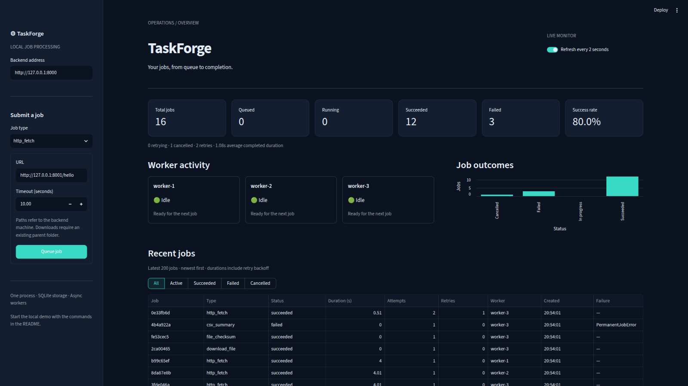
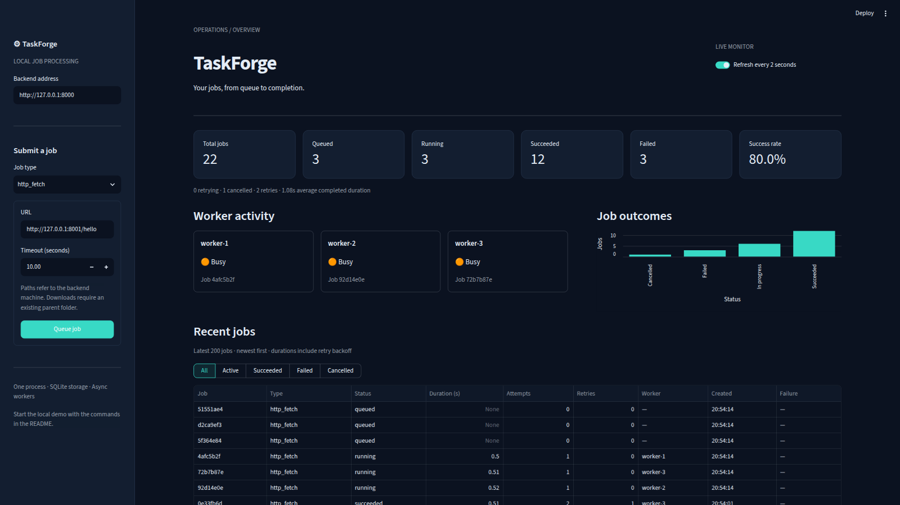
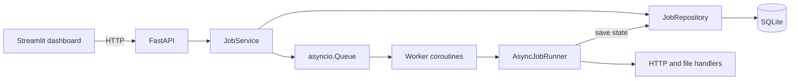

# TaskForge

TaskForge is a local asynchronous job processing platform with a FastAPI backend
and a Streamlit monitoring dashboard. Submit HTTP or file jobs, watch multiple
workers execute them, and inspect results, retries and failures.

Built with Python 3.12, asyncio, httpx, SQLAlchemy and SQLite. It runs locally
using free, open-source tools and needs no API keys, paid services or hosting.

## Features

- Four job types: HTTP fetch, file download, SHA-256 checksum and CSV summary.
- Multiple worker coroutines backed by an `asyncio.Queue`.
- Validated job lifecycle, cancellation and exponential retry backoff.
- SQLite persistence, queued-job recovery and timestamped execution history.
- Typed API models, JSON metrics and interactive API documentation.
- A dark-themed dashboard with status cards, worker activity, job results,
  durations, retry counts and failure types.
- Behavior tests, ruff, strict mypy checks, GitHub Actions and optional Docker.

## Dashboard

Status counts, worker activity and recent job results from the local demo.



The dashboard refreshes as jobs run. Here, three workers are processing HTTP
requests while additional jobs wait in the queue.



## Quick start

Install [uv](https://docs.astral.sh/uv/getting-started/installation/), then:

```bash
git clone https://github.com/danielnrz/taskforge-python.git
cd taskforge-python
uv sync --locked
```

uv uses the Python version specified in `.python-version` and can download it
if needed. Run all commands below from the repository root.

Start the backend:

```bash
uv run taskforge-python
```

In another terminal, start the dashboard:

```bash
uv run streamlit run dashboard/app.py --server.address 127.0.0.1
```

- Dashboard: <http://127.0.0.1:8501>
- API documentation: <http://127.0.0.1:8000/docs>
- Health: <http://127.0.0.1:8000/health>

Both services bind to loopback by default. Stop them with Ctrl+C. Normal local
use does not require Docker.

## Local demo

With the backend and dashboard running, start the local HTTP targets in a third
terminal:

```bash
uv run uvicorn scripts.demo_server:app --host 127.0.0.1 --port 8001
```

Then populate the dashboard:

```bash
uv run python scripts/seed_demo.py
```

The demo creates sample files under `data/demo/` and queues all four job types,
a temporary HTTP failure followed by a successful retry, permanent failures,
a cancelled request and four slow requests to demonstrate concurrency. No
internet requests are made. Run it again for another batch; each download uses
a unique filename.

In the dashboard, watch the workers become busy, inspect the CSV result, filter
failed jobs and compare their error types. The retrying HTTP job completes on
its second attempt. Toggle automatic refresh to pause the view. You can also
submit jobs and cancel queued, running or retrying jobs from the dashboard.

## Live demo deployment

The public dashboard is prepared for **Streamlit Community Cloud**, with its
backend on a **Render Free Web Service**. Deployment URLs will be added after
setup. The free backend may take about one minute to wake after inactivity;
the dashboard shows a starting message and retries automatically.

Render Free uses an ephemeral filesystem: SQLite history and downloaded files
can disappear on restart, redeploy or spin-down. With `TASKFORGE_DEMO_MODE=true`,
startup restores missing sample files and adds a checksum, a valid CSV summary
and a deliberately malformed CSV job **only when the database is empty**.
Existing files and job history are preserved when present. Refreshing the
dashboard does not add jobs. These storage limits affect the hosted demo;
local SQLite persistence and the single-process worker design remain unchanged.

The hosted demo also exposes `/demo/hello` and `/demo/download` as HTTP targets.
Use these with the dashboard's HTTP fetch/download forms; file jobs can use
`data/demo/sample.txt` and `data/demo/scores.csv`. Downloads need a new destination
filename each time. This is disposable, public sample data; do not submit private
files, credentials or sensitive URLs.

### Render settings

Log in to Render and connect the GitHub repository. You can create a Blueprint
from the included `render.yaml`, or create a **Web Service** with these settings:

| Setting | Value |
| --- | --- |
| Repository | `https://github.com/danielnrz/taskforge-python` |
| Branch | `main` |
| Root directory | Leave blank (repository root) |
| Runtime | Python 3 |
| Instance plan | **Free** |
| Build command | `uv sync --locked --no-dev` |
| Start command | `uv run --no-sync uvicorn taskforge_python.api:create_app --factory --host 0.0.0.0 --port $PORT --workers 1` |
| Health check path | `/health` |

Set these environment variables (also included in `render.yaml`):

```text
PYTHON_VERSION=3.12.14
UV_VERSION=0.12.21
TASKFORGE_DEMO_MODE=true
TASKFORGE_WORKERS=3
TASKFORGE_DATABASE_URL=sqlite+aiosqlite:///data/taskforge.db
```

Render supplies `PORT`; the start command binds to that port on all interfaces.
Keep one uvicorn process. Do not add a persistent disk, database service or paid
instance. Use the free workspace without a payment method so exceeding included
usage suspends service/builds instead of purchasing extra capacity. Free hosting
has usage limits and does not guarantee uninterrupted availability. See
[Render's free service limits](https://render.com/docs/free).

To check the hosted-demo mode locally:

```bash
TASKFORGE_DEMO_MODE=true uv run taskforge-python
```

This seeds an empty database only. Use a separate SQLite path if you want to keep
an existing local history separate; create its parent directory first.

### Streamlit Community Cloud settings

Log in to Streamlit Community Cloud, authorize GitHub access, and choose
**Create app**:

| Setting | Value |
| --- | --- |
| Repository | `danielnrz/taskforge-python` |
| Branch | `main` |
| Main file path | `dashboard/app.py` |
| Python version (Advanced settings) | **3.12** |

In **Advanced settings → Secrets**, add this root-level TOML entry, replacing the
placeholder with the HTTPS URL assigned to the Render backend (without `/docs`):

```toml
TASKFORGE_API_URL = "<your Render backend URL>"
```

The dashboard reads this secret or the environment variable of the same name.
An environment variable takes precedence. Do not commit `.streamlit/secrets.toml`.
Community Cloud installs dependencies from the root `uv.lock`, so a second
`requirements.txt` is unnecessary; `pyproject.toml` and `uv.lock` remain the
sources for local development. See [Community Cloud dependency support](https://docs.streamlit.io/deploy/streamlit-community-cloud/deploy-your-app/app-dependencies).
The Streamlit server address is left configurable for cloud hosting; the local
command above explicitly binds it to loopback.

## Architecture



`Job` holds data and validates state transitions. Execution is composed from
handlers, a retry policy and a runner. `JobService` coordinates submission,
cancellation and workers; routes translate HTTP requests into service calls.
The repository stores detached job snapshots and hides SQLAlchemy sessions.
The dashboard communicates exclusively through the API.

The original synchronous `JobRunner` remains as a small checksum execution
example. The application uses `AsyncJobRunner` for all four job types.

## Supported jobs

`POST /jobs` accepts `job_type` and a type-specific `payload`:

| Job type | Payload | Result |
| --- | --- | --- |
| `http_fetch` | `url`, optional `timeout`, `max_bytes` | Status, URL, content type, byte count and decoded body |
| `download_file` | `url`, `path`, optional `timeout`, `max_bytes` | Destination, byte count and HTTP status |
| `file_checksum` | `path` | SHA-256 hexadecimal digest |
| `csv_summary` | `path` | Row count, columns, non-empty counts and numeric statistics |

For example, while the demo targets are running:

```bash
curl -X POST http://127.0.0.1:8000/jobs \
  -H 'Content-Type: application/json' \
  -d '{"job_type":"http_fetch","payload":{"url":"http://127.0.0.1:8001/hello"}}'
```

Paths belong to the **backend machine** and are resolved relative to its working
directory. The download parent directory must already exist. Downloads never
replace existing files; a temporary file is published atomically on success and
removed on failure or cancellation. HTTP and HTTPS are supported; redirects
are treated as permanent failures in V1.

HTTP jobs use a shared `httpx.AsyncClient` and stream response bodies. The default
timeout is 10 seconds per network operation, configurable up to 120 seconds.
HTTP fetches default to a 1 MB limit (maximum 10 MB), and downloads default to
10 MB (maximum 100 MB). Limits apply to decoded response bytes.

Checksum and CSV work run through `asyncio.to_thread()` so they do not block the
event loop. CSV files must be UTF-8, have unique, non-empty headers and the same
number of fields in every row. Blank numeric cells are ignored. A column gets
numeric statistics only when all of its non-empty cells contain finite numbers.

## Lifecycle and retries

```text
queued → running → succeeded
                 → failed
                 → retrying → running → succeeded / failed
queued / running / retrying → cancelled
```

Each job records its ID, type, payload, timestamps, attempt count, worker, result,
error message and failure type. The first start timestamp is retained across
retries; duration includes execution and backoff, but excludes time in the queue.

The default `RetryPolicy` allows three total attempts, with delays of 0.5 and
1.0 seconds. Connection/transport errors, network timeouts, HTTP 429 and
500/502/503/504 are retryable. HTTP 404, other non-success statuses, malformed
CSV, missing files and invalid input are permanent failures.

A worker retains its job during retry backoff. Cancellation interrupts network
requests and backoff. A filesystem operation already running in a thread must
finish before cancellation completes; Python cannot safely terminate that thread.
Normal shutdown cancels active jobs and leaves queued jobs for the next startup.
Standard logging records job ID, worker, attempt, status, runtime and errors.

## Persistence

The default database is `data/taskforge.db`. It is created on startup and ignored
by Git. Every lifecycle update is persisted in SQLite. The `asyncio.Queue` itself
is **in memory**. Startup restores persisted queued jobs. Jobs left running or
retrying after an interrupted process become failed with an `InterruptedJob`
error rather than being automatically re-executed.

Configuration:

| Variable | Default | Purpose |
| --- | --- | --- |
| `TASKFORGE_DATABASE_URL` | `sqlite+aiosqlite:///data/taskforge.db` | SQLite database location |
| `TASKFORGE_DEMO_MODE` | `false` | Restore hosted sample files and seed an empty database |
| `TASKFORGE_WORKERS` | `3` | Worker coroutines, between 1 and 16 |
| `TASKFORGE_API_URL` | `http://127.0.0.1:8000` | Dashboard backend address |

For a custom database location, create its parent directory first. To use a
different API port, run uvicorn directly:

```bash
uv run uvicorn taskforge_python.api:create_app --factory --host 127.0.0.1 --port 8002
TASKFORGE_API_URL=http://127.0.0.1:8002 uv run streamlit run dashboard/app.py --server.address 127.0.0.1
```

## API

| Method | Endpoint | Behavior |
| --- | --- | --- |
| `POST` | `/jobs` | Validate and queue a job; returns 202 |
| `GET` | `/jobs` | Newest jobs first; optional `status` and `limit` (1–1000, default 100) |
| `GET` | `/jobs/{job_id}` | Job data, result and duration |
| `DELETE` | `/jobs/{job_id}` | Cancel an active job; retain its history |
| `GET` | `/workers` | Worker IDs, state and current job |
| `GET` | `/health` | Worker availability |
| `GET` | `/metrics` | Status counts, success rate, average duration, retries and failure types |

Missing jobs return 404, invalid input returns 422 and cancelling a finished job
returns 409. Metrics include all stored jobs. Success rate is
`succeeded / (succeeded + failed) × 100`, excluding active and cancelled jobs.
Average duration includes completed jobs that started, including cancellations.
The dashboard lists the latest 200 jobs while its cards show all-history counts.

## Tests and code quality

```bash
uv run pytest
uv run ruff check .
uv run ruff format --check .
uv run mypy
```

Tests cover lifecycle rules, all handlers, malformed inputs, mocked HTTP status
codes and timeouts, byte limits, retries, attempt limits, concurrency,
cancellation, worker shutdown, SQLite persistence, startup recovery, API routes,
metrics and dashboard interaction through a live local API. HTTP handler tests
use mocked transports and need no internet access. mypy checks application code,
the dashboard and demo scripts. GitHub Actions runs the same quality checks.

## Docker

Docker is optional. Container build/run verification remains pending on a
machine with Docker daemon access and Compose installed. The local backend,
dashboard and test suite can run without it.

With a working Docker daemon and Compose:

```bash
docker compose up --build
```

This starts the backend and dashboard at the same local addresses. Database and
files under `/app/data` persist in the `taskforge-data` named volume. Paths entered
in the dashboard refer to the container; use `/app/data/...` for writable files.
The application runs as a non-root user.

For the container demo:

```bash
docker compose --profile demo up --build -d
docker compose exec backend python scripts/seed_demo.py --targets http://demo:8001
```

Stop the services while retaining data:

```bash
docker compose down
```

To run only the backend without Compose:

```bash
docker build -t taskforge:local .
docker run --rm -p 127.0.0.1:8000:8000 -v taskforge-data:/app/data taskforge:local
```

## Project structure

```text
src/taskforge_python/
  models.py              Job data and lifecycle rules
  handlers.py            Synchronous SHA-256 handler
  runner.py              Original synchronous runner
  payloads.py            Type-specific input validation
  async_handlers.py      Async HTTP and threaded file handlers
  async_runner.py        Execution, retries and logging
  retry.py               Exponential backoff policy
  repository.py          SQLite persistence
  service.py             Queue, workers and job operations
  schemas.py             API request and response models
  api.py                 FastAPI routes and lifespan
  demo.py                Optional hosted sample inputs and HTTP targets
  dashboard_client.py    HTTP calls used by the dashboard
  exceptions.py          Application errors
dashboard/app.py         Streamlit monitoring interface
scripts/                 Local HTTP demo targets and sample job submission
tests/                   Behavior and integration tests
.github/workflows/       Automated checks
```

## Limitations and next steps

- V1 supports one backend process. Do not use multiple uvicorn workers or share
  the database between running backend instances. There is no distributed queue.
- This is a trusted local tool without authentication. Jobs can read local files,
  write downloads and request user-provided URLs. Keep normal use on loopback.
  The hosted portfolio demo is disposable and
  must contain only public samples; broader use would require authentication
  and filesystem/network controls.
- The queue has no size limit. History queries load stored jobs into memory, and
  CSV summaries retain numeric values in memory. These choices suit small local
  workloads; pagination, retention and streaming aggregates would be useful next.
- Retry schedules and in-flight work are not recovered after a crash. A sudden
  crash may leave temporary download files or a completed download whose final
  status was not persisted. Inspect those files before resubmitting.
- HTTP timeouts apply per network operation, not to total job duration. A slow
  streaming response can take longer than the configured timeout.
- Schema creation is automatic; V1 does not include database migrations.

Possible improvements include paginated history, scheduled jobs, configurable
retry policies at the API boundary and a small migration strategy. They can be
added without changing the single-process worker design.
